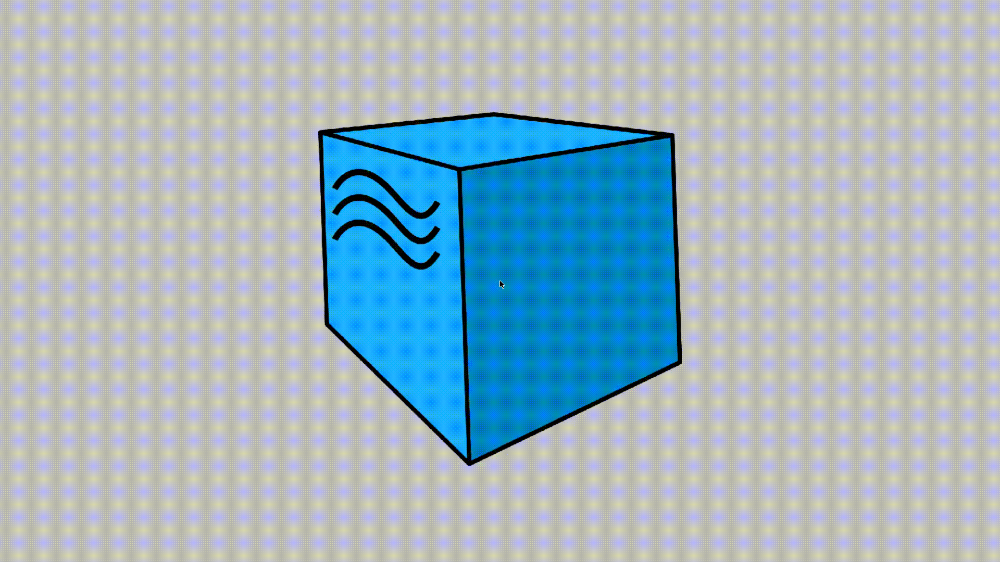
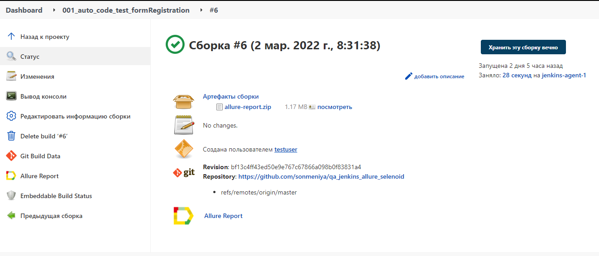
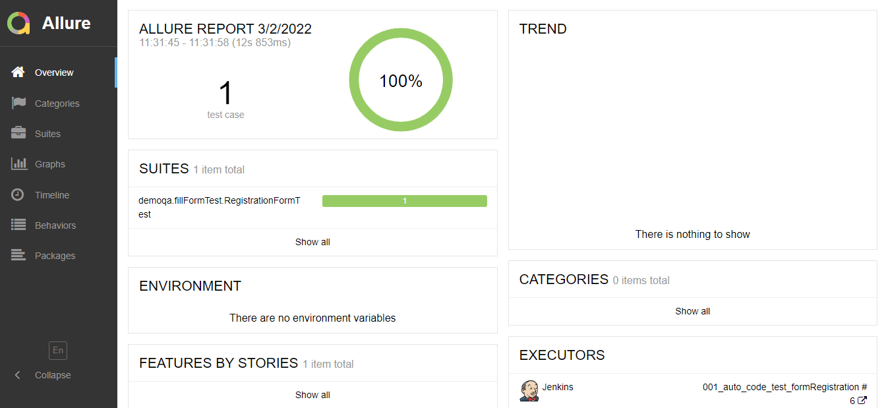

#  qa_jenkins_allure_selenoid

IntelliJ IDEA, Java, Selenide, Selenoid, Gradle, JUnit5, Allure Report,  Github, Jenkins.

### Тест на заполнение формы регистрации
- [X] - Открываем страницу для заполнения формы https://demoqa.com/automation-practice-form
- [X] - Вводим данные в формы регистрации (имя, фамилию, адрес почты, пол и остальные)
- [X] - Нажимаем на кнопку submit и отправляем данные
- [X] - Сверяем заполненные данные с загруженными

### Видео о прохождении тестов

### Запуск в Jenkins

### Отчёт в Allure Report

 